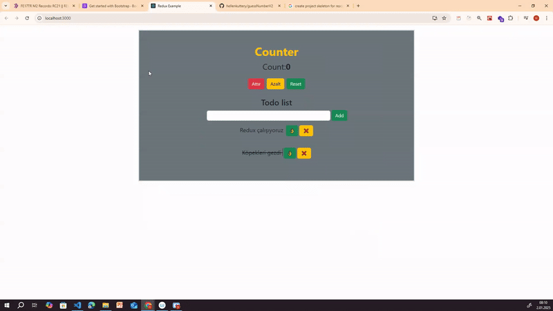

# Counter and ToDo List using Redux

## Description
This project demonstrates the usage of **Redux** for state management by building two simple applications: a **Counter** and a **ToDo List**.

---

## Problem Statement

- Your company is exploring Redux as a state management library, and you have been assigned to showcase its implementation.
- The project contains:
  1. A **Counter** application where:
     - The user can increment, decrement, or reset the counter.
  2. A **ToDo List** application where:
     - The user can add, delete, and mark tasks as completed.
- The project is designed to highlight Redux concepts such as:
  - **Actions**  
  - **Reducers**  
  - **Store**  
  - **Connecting components with Redux**  
  - Managing separate state slices for different components.

---

## Project Skeleton


```
redux-project (folder) | |----readme.md # Project definition and description
|----src |----components | |----Counter.js | |----ToDoList.js | |----redux |----actions.js |----reducers.js |----store.js
```
## Expected Outcome

The project contains two working applications:

1. **Counter**  
   - A simple counter interface where the user can:
     - Increment the count.
     - Decrement the count.
     - Reset the count.
   - Example UI:
     - **"Counter: 0"**
     - Buttons: **Increment**, **Decrement**, **Reset**.

2. **ToDo List**  
   - A dynamic list where the user can:
     - Add new tasks.
     - Mark tasks as completed.
     - Delete tasks.
   - Example UI:
     - Input: **"Enter a new task"**
     - List of tasks with checkboxes and delete buttons.

---

## Objective

The objective is to showcase the basic usage of Redux for state management in React applications by building:
1. A **Counter** application.
2. A **ToDo List** application.

---

## Project Snapshot


---
## Live Demo
[Live Redux Project](https://hellenkuttery.github.io/redux-example/)

---

## Notes
- The **Counter** and **ToDo List** components are located under the `src/components` directory.
- Redux-related files, such as **actions**, **reducers**, and **store**, are located under the `src/redux` directory.
